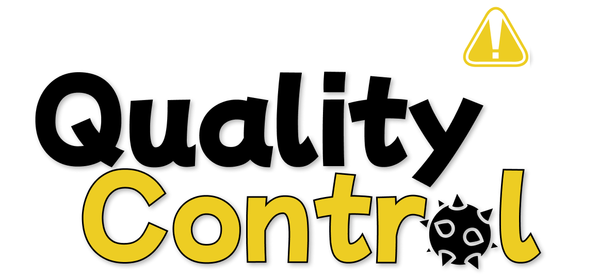

<p align="center">  
    
</p>
<p align="center">
    <font size="5"><strong>⚠️  Quality Control  ⚠️</strong></font><br />
    <em>Created by: Paul Cavallo, June Ka, John Lim, Jake Pauls, and Kiwon Song</em>
</p>
<p align="center">
    
    
    
</p>

### Overview
QualityControl is a variant on "endless" iPhone games where players are dropped into a game test environment and must survive the onslaught of obstacles the evil developers throw at them. 

The goal is to dodge waves of projectiles while navigating the platform and collecting coins to accumulate score. Get hit by projectiles three times and its game over! 

### Instructions

- Clone this repository
- Load the project into Xcode
- Build for an applicable iOS device (refer to the [Target Devices](#target-devices) section for more information)

### Installation Notes
To install quality-control, clone this repo and its submodules recursively (this is required for assimp and glm).

```
$ git clone https://github.com:/jake-pauls/quality-control.git
$ git submodule update --init --recursive
```

### Building Notes
Please note that the `assimp-fat.a` binary **must** be linked to the project if building to a physical device. At the moment, this fat binary only supports arm64 iOS devices in order to fit into the repository.

### Target Devices
iPhones and iPods on iOS 15.2 and above
